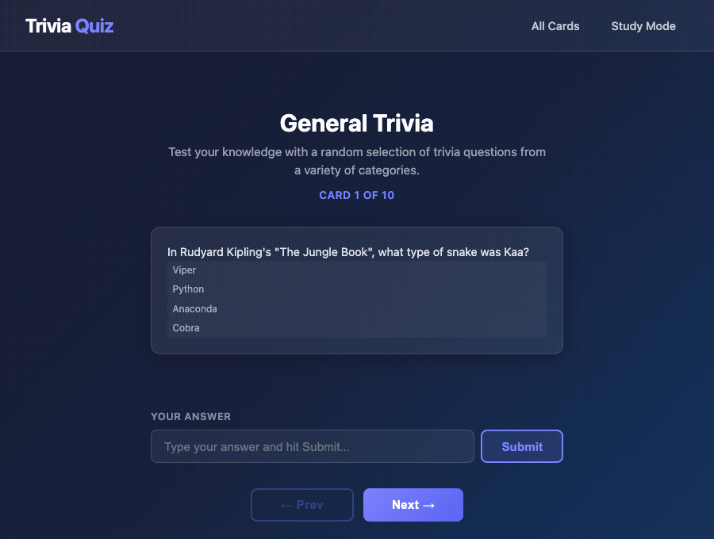

# Web Development Project 3 - Flashcards! Part 2

Submitted by: **Adam Solomon**

This web app: **An interactive trivia flashcard app powered by the Open Trivia Database. Users can type in a guess before flipping a card to check their answer, navigate sequentially through all 10 cards, and see instant visual feedback on whether their answer was correct or incorrect.**

Time spent: **5** hours spent in total

## Required Features

The following **required** functionality is completed:

- [x] **The user can submit a guess into an input box before seeing the flipside of a card**
  - [x] Application features a clearly labeled input box with a submit button where users can type in a guess
  - [x] Clicking on the submit button with an incorrect answer shows visual feedback that it is wrong
  - [x] Clicking on the submit button with a correct answer shows visual feedback that it is correct
- [x] **The user can navigate through an ordered list of cards**
  - [x] A forward/next button displayed on the card navigates to the next card in a set sequence when clicked
  - [x] A previous/back button displayed on the card returns to the previous card in the set sequence when clicked
  - [x] Both the next and back buttons are visually grayed out and disabled at the beginning and end of the list (no wrap-around)

## Optional Features

The following **optional** features are implemented:

- [x] A user's answer may be counted as correct even when it is slightly different from the target answer
  - Answers are compared case-insensitively with all punctuation stripped (e.g. "True" matches "true", "France!" matches "France")
- [ ] Users can use a shuffle button to randomize the order of the cards
- [ ] A counter displays the user's current and longest streak of correct responses
- [ ] A user can mark a card that they have mastered and have it removed from the pool

## Additional Features

* [x] Card counter shows current position ("Card 3 of 10")
* [x] Guess input and card flip state both reset automatically when navigating to a new card
* [x] Pressing Enter in the input box submits the guess
* [x] Input border color changes to green/red to reinforce correct/incorrect feedback
* [x] All Cards view — displays the full set in a responsive grid
* [x] Answer options displayed on the front of each card (pulled from the API's incorrect answers)
* [x] 3D flip animation when clicking a card
* [x] Cards dynamically resize to fit their content
* [x] Dark gradient UI with glassmorphism navbar

## Video Walkthrough

Here's a walkthrough of implemented required features:

<!-- Replace this comment with your GIF.
     Recommended tools (free):
       • Kap (macOS): https://getkap.co  — record → export as GIF
       • LICEcap: https://www.cockos.com/licecap/
     Steps to show:
       1. Open /card-test page
       2. Type a wrong answer → submit (show red feedback)
       3. Type the correct answer → submit (show green feedback)
       4. Click Next a few times, then click Prev back to the first card
       5. Show Next is disabled on the last card, Prev is disabled on the first
-->

## Notes

- Answer guesses use fuzzy matching: comparisons are case-insensitive and strip all punctuation so minor typos or capitalization differences don't count as wrong.
- The `QuestionGuess` component is keyed to `currentIndex` so its state (typed guess and feedback) fully resets every time the user navigates to a new card.
- Cards use `position: absolute` for the 3D flip effect, so their height is calculated dynamically via `getBoundingClientRect` to prevent the card border from clipping content.
- The Open Trivia Database API returns HTML entities in question/answer text; a `decodeString` helper using a hidden `<textarea>` renders them correctly.

## License

    Copyright 2026 Adam Solomon

    Licensed under the Apache License, Version 2.0 (the "License");
    you may not use this file except in compliance with the License.
    You may obtain a copy of the License at

        http://www.apache.org/licenses/LICENSE-2.0

    Unless required by applicable law or agreed to in writing, software
    distributed under the License is distributed on an "AS IS" BASIS,
    WITHOUT WARRANTIES OR CONDITIONS OF ANY KIND, either express or implied.
    See the License for the specific language governing permissions and
    limitations under the License.
